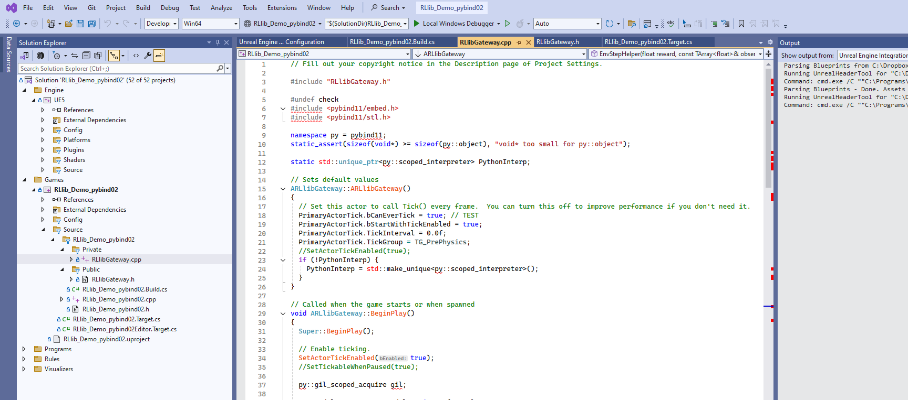
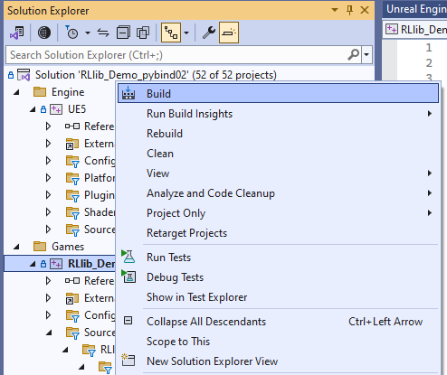
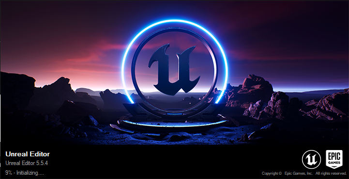
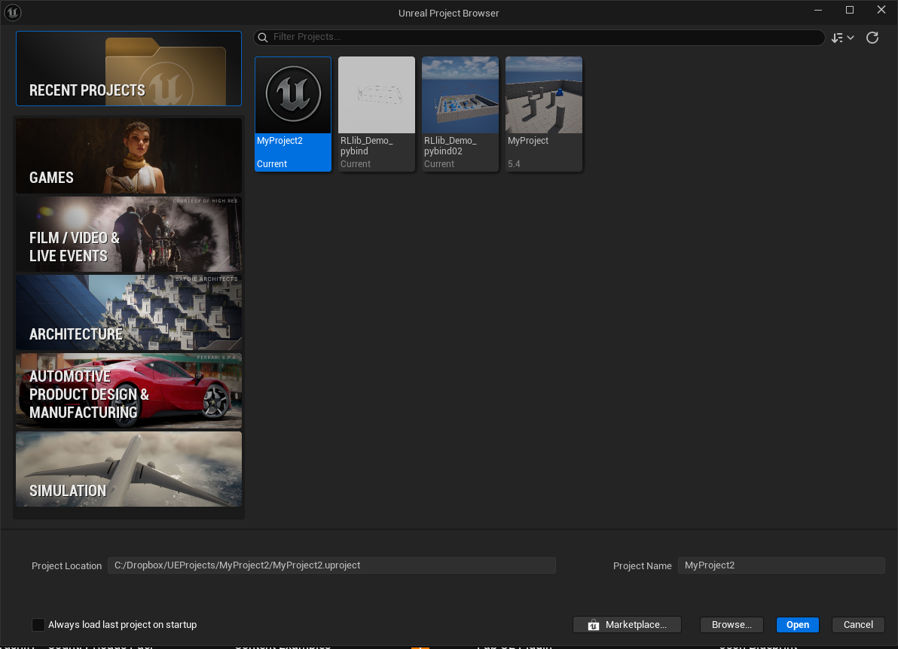

RLlib_UE5_Demo
==============

**TLDR;** An RLlib-ready Unreal Engine 5 project. Uses Anyscale/RLlib's pybind11 utility for C++ simulators
to quickly and conveniently connect from your game to a running RLlib server and start or continue training
an agent policy.

Prerequisites
-------------

Windows
*******

Install git for Win and `git clone [this repo]` to your local computer.

Download `Unreal Engine 5 <https://www.unrealengine.com/>`__, start the Epic Launcher, then install UE5 (version 5.5.4).

Download Visual Studio Community 2022. This repo was created with version 17.12.1, but there is no reason more recent
ones should not work as well.

Download and install `Anaconda <https://www.anaconda.com/>`__ on your PC.

Open a terminal window (as administrator) and run these commands:

.. code-block:: bash

    $ conda create -n ue5_rllib python=3.11
    $ conda activate ue5_rllib

Then pip-install `ray[rllib]` in the new conda environment and link a `rayturbo` git repo into this installation:

.. code-block:: bash

    $ cd rayturbo
    $ python python/ray/setup-dev.py  # link RLlib only

Installation
------------

Windows
*******

Open a "File Explorer" window and browse to this downloaded UE5 project repo. Right-click on the `RLlib_UE5_Demo.uproject`
file and select the "Generate Visual Studio Project Files" option. This should create a
new `RLlib_UE5_Demo.sln` file in the same folder or update a possibly already existing one.

Double click on this `.sln` file. Visual Studio should start. You should see something like this:

First, setup the build paths of your project. Open the `RLlib_UE5_Demo.Build.cs` file. You can find this file
inside `Games/RLlib_UE5_Demo/Source/RLlib_UE5_Demo/`.

Make sure that the 3 paths for the pybind11 header files, the python library file, and the python include files
are specified correctly. You may need to adjust these depending on your python anaconda setup and pybind11 location.

Try building the project by right clicking on the `RLlib_UE5_Demo` project within the project tree and then click
on "build":

Visual Studio + UE5 builds can be painful sometimes due to missing dependencies and cryptic errors. Make sure
you use GPT or any other powerful chat bot to get as much help as possible to get your first build to run through ok.

After Visual Studio reports that the build succeeded without errors, you should now be able to start the game and
run it against RLlib/rayturbo.

Starting the game in the UE5 editor
-----------------------------------

Launch UE5.5.4 through the Epic Launcher app.

When the "select project" screen appears, this UE5 project usually doesn't show up yet in any panels, because you
haven't opened it yet on your PC. Instead, enter the location of the ``RLlib_UE5_Demo.uproject`` file at the
root of this repo manually and then click "open".

